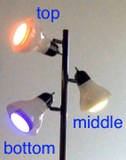
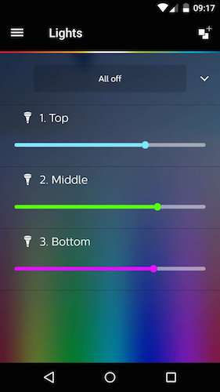

.. _parsetron_tutorial:

==================
Parsetron Tutorial
==================

.. Bootstrap specific class labels

.. role:: text-success
.. role:: text-primary
.. role:: text-info
.. role:: text-warning
.. role:: text-danger

.. role:: bg-success
.. role:: bg-primary
.. role:: bg-info
.. role:: bg-warning
.. role:: bg-danger

What It is
==========

Parsetron is a semantic parser that converts natural language text into API calls.
Typical usage scenarios include for instance:

* control your smart light with language, e.g.:

  - :text-success:`give me something romantic`
  - :text-success:`my living room light is too dark`
  - :text-success:`change bedroom light to sky blue`
  - :text-success:`blink living room light twice in red color`

* control your microwave with language, e.g.:

  - :text-success:`defrost this chicken please, the weight is 4 pounds`
  - :text-success:`heat up the pizza for 2 minutes 20 seconds`
  - :text-success:`warm up the milk for 1 minute`

The difficult job here is to extract key information from the natural language
command to help developers call certain APIs to control a smart device.
Conventional approach is writing a bunch of rules, such as regular expressions,
which are difficult to maintain, read, and expand. Computational linguists opt
for writing `Context Free Grammars <http://en.wikipedia.org/wiki/Context-free_grammar>`_.
But the learning curve is high and the parser output -- usually a constituency tree
or a dependency relation -- is not directly helpful in our tasks.

Parsetron is designed to tackle these challenges.  Its design philosophy
is to **make natural language understanding easy** for developers with no background
in computational linguistics, or natural language processing (NLP).

Parsetron has the following properties:

* **easy to use**: grammar definition is in Python; thus developers do not have to
  learn another format (traditionally grammars are usually defined in BNF format).
* **robust**: it omits unknown (not defined in grammar) word when parsing; it also
  parses multi-token phrases (modern NLP parsers are only single-token based).
* **incremental**: it emits parse result as soon as it's available; this helps in
  applications requiring quick responding time, such as through speech interaction.
* **flexible**: users can define their own pre-parsing tokenization and post-parsing
  callback functions in their grammar specification; this assigns developers as much
  power as Python has.

It understands language per definition of a semantic grammar.

How it works
============

Parsetron is a
`Chart Parser <https://en.wikipedia.org/wiki/Chart_parser>`_ for
`Context Free Grammars <https://en.wikipedia.org/wiki/Context-free_grammar>`_
(CFGs).
It works in the following way:

1. Accept a grammar extended from :class:`parsetron.Grammar`, which must have a
   ``GOAL`` defined (similar to the start symbol ``S`` in CFGs). The grammar
   is defined in Python (so :text-warning:`no extra learning curve for
   Python developers`!).
2. Tokenize an input string by white spaces.
3. Construct a :class:`parsetron.Chart` and parse with a default Left Corner
   Top Down strategy.

   * unknown words not defined in the grammar are automatically omitted.
   * if single tokens are not recognized, parsetron also tries to recognize
     phrases.

4. Output a conventional linguistic tree, and a :class:`parsetron.ParseResult`
   for easier interpretation.

   * results are ranked by the minimal tree sizes.
   * in the future parsetron will provide probabilistic ranking.

5. Run post processing on the parse result if any call-back functions are
   defined via the :func:`parsetron.GrammarElement.set_result_action` function
   in the grammar.

Parsetron is inspired by `pyparsing <https://pyparsing.wikispaces.com/>`_,
providing a lot of classes with the same intuitive names. pyparsing implements
a top-down recursive parsing algorithm, which is good for parsing unambiguous
input, but not for natural languages. Parsetron is specifically designed for
parsing natural language instructions.

Installation
============

Parsetron is available through PyPI::

    pip install parsetron

Alternatively, Parsetron comes as a single ``parsetron.py`` file.
Just download it from the
`repository <https://github.com/Kitt-AI/parsetron>`_ and put the file under
your ``PYTHONPATH`` or current directory so that you can do::

    import parsetron

or::

    from parsetron import *

Parsetron can be run with either CPython 2.7 or `PyPy <http://pypy.org>`_.
If PyPy is warmed up, the parsing speed is about 3x that of CPython.
At the current stage Parsetron doesn't support Python 3 yet.

In the following we provide a simple example of controlling your smart lights
with natural language instructions.

A Light Grammar
===============

We start by writing a grammar for smart light bulbs. Our lights of interest are
`the Philips Hue <http://www2.meethue.com>`_. The starter pack contains three
light bulbs and a bridge:

Your application talks to the bridge through shared WiFi and the bridge talks
to the light bulbs through Zigbee. The bridge responds to
`RESTful API <http://www.developers.meethue.com/philips-hue-api>`_ calls.

In Kitt.AI office, we have the 3-bulb starter pack set up like this:

The three bulbs are named **top**, **middle**, and **bottom** for easier
reference. Most people would name them by *living room*, *bedroom*, etc. It's
your choice. However, no matter what you name those bulbs, you **must**
register them with the Hue bridge either through their Restful APIs, or through
the app:

Now imagine we want to parse the following simple sentences:

1. :text-success:`set my top light to red`
2. :text-success:`set my top light to red and change middle light to yellow`
3. :text-success:`set my top light to red and change middle light to yellow
   and flash bottom light twice in blue`

We can define a simple grammar in the following Python code:

.. code-block:: python
   :linenos:

    from parsetron import *

    class LightGrammar(Grammar):
        action = Set(['change', 'flash', 'set', 'blink'])
        light = Set(['top', 'middle', 'bottom'])
        color = Regex(r'(red|yellow|blue|orange|purple|...)')
        times = Set(['once', 'twice', 'three times']) | Regex(r'\d+ times')

        one_parse = action + light + Optional(times) + color
        GOAL = one_parse | one_parse + one_parse | one_parse + one_parse + one_parse

The above code defined a minimal grammar that would parse our test sentences.
Here's a step-by-step explanation.

*  on line 3 we defined a ``LightGrammar`` class that extends a standard
   :class:`parsetron.Grammar`. Defining grammars in classes helps modularization.
*  on lines 4-5, we used a :class:`parsetron.Set` class to match anything
   that's in the set:

   .. code-block:: python

       action = Set(['change', 'flash', 'set', 'blink'])
       light = Set(['top', 'middle', 'bottom'])

*  on line 6, instead of using a set, we used a regular expression to encode
   color names::

        color = Regex(r'(red|yellow|blue|orange|purple|...)')

   Note that there could be
   `hundreds of color names <http://en.wikipedia.org/wiki/List_of_colors:_A%E2%80%93F>`_.
   A :class:`parsetron.Regex` builds a finite state machine to efficiently code
   them. But of course we can also use a Set.
*  on line 7, we introduced the ``|`` operator, which encodes a :class:`parsetron.Or`
   relation to specify alternative ways of representing ``times``::

        times = Set(['once', 'twice', 'three times']) | Regex(r'\d+ times')

   So ``times`` can either match *"three times"*, or *"3 times"*.
*  on line 9, we defined a ``one_parse`` of a sentence, which represents a single minimal
   set of information encoded in a parse::

        one_parse = action + light + Optional(times) + color

   The ``+`` operator here encodes a :class:`parsetron.And` relation, matching a
   sequence of tokens. For unknown words parsetron simply ignores them. The
   :class:`parsetron.Optional` class is a kind of syntactic sugar indicating
   that we can match 0 or 1 time of ``times`` here. Thus this single
   ``one_parse`` parses both of the following sentences:

   a. :text-success:`blink my top light in red`
   b. :text-success:`blink my top light` **twice** :text-success:`in red`

   Note that ``one_parse`` doesn't parse sentences 2 and 3 above, which contain
   coordination:

   2. **coordination**: :text-success:`set my top light to red` **and**
      :text-success:`change middle light to yellow`
   3. **coordination**: :text-success:`set my top light to red` **and**
      :text-success:`change middle light to yellow`
      **and** :text-success:`flash bottom light twice in blue`

   thus on line 10 we concatenated ``one_parse`` two and three times to make parses::

        GOAL = one_parse | one_parse + one_parse | one_parse + one_parse + one_parse

*  line 10 is **ugly** however. Alternatively we can write:

   .. code-block:: python

        GOAL = one_parse * [1, 3] # or:
        GOAL = one_parse * (1, 3)

   meaning that a ``GOAL`` contains a ``one_parse`` one to three times. But then it is
   **not flexible**: what if there's a fourth coordination? So we simply change it to:

   .. code-block:: python

       GOAL = one_parse * (1, ) # one or more times, but better with:
       GOAL = OneOrMore(one_parse)

   Now our ``GOAL`` can parse however many ``one_parse`` 's using :class:`parsetron.OneOrMore`!

   .. note::

       You can freely define all kinds of variables in your grammar, but then
       **have to** define a ``GOAL`` so the parser knows where to start.
       ``GOAL`` here is equivalent to what conventionally is called the START
       symbol ``S`` in CFGs.

   .. warning::

       The ``|`` operator has lower precedence than the ``+`` operator. Thus
       the following code::

            a = b | c + d

       is equal to::

            a = b | (c + d)

       rather than::

            a = (b | c) + d

Finally we have a very simple grammar defined for smart light:

.. code-block:: python
   :linenos:

    from parsetron import *

    class LightGrammar(Grammar):
        action = Set(['change', 'flash', 'set', 'blink'])
        light = Set(['top', 'middle', 'bottom'])
        color = Regex(r'(red|yellow|blue|orange|purple|...)')
        times = Set(['once', 'twice', 'three times']) | Regex(r'\d+ times')

        one_parse = action + light + Optional(times) + color
        GOAL = OneOrMore(one_parse)

Let's Parse It
==============

To parse sentences, we first construct a :class:`parsetron.RobustParser`, then
call its :func:`parsetron.RobustParser.parse` function:

.. code-block:: python

    parser = RobustParser(LightGrammar()
    sents = ["set my top light to red",
        "set my top light to red and change middle light to yellow",
        "set my top light to red and change middle light to yellow and flash bottom light twice in blue"]
    for sent in sents:
        tree, result = parser.parse(sent)
        print '"%s"' % sent
        print "parse tree:"
        print tree
        print "parse result:"
        print result.pretty_str()
        print

And here's the output:

.. code-block:: python

    "set my top light to red"
    parse tree:
    (GOAL
      (one_parse
        (action "set")
        (light "top")
        (color "red")
      )
    )

    parse result:
    { 'GOAL': [['set', 'top', 'red']],
      'one_parse': [ {'action': 'set', 'one_parse': ['set', 'top', 'red'], 'color': 'red', 'light': 'top'}]}

    "set my top light to red and change middle light to yellow"
    parse tree:
    (GOAL
      (one_parse
        (action "set")
        (light "top")
        (color "red")
      )
      (one_parse
        (action "change")
        (light "middle")
        (color "yellow")
      )
    )

    parse result:
    { 'GOAL': [['set', 'top', 'red'], ['change', 'middle', 'yellow']],
      'one_parse': [ {'action': 'set', 'one_parse': ['set', 'top', 'red'], 'color': 'red', 'light': 'top'},
                     {'action': 'change', 'one_parse': ['change', 'middle', 'yellow'], 'color': 'yellow', 'light': 'middle'}]}

    "set my top light to red and change middle light to yellow and flash bottom light twice in blue"
    parse tree:
    (GOAL
      (one_parse
        (action "set")
        (light "top")
        (color "red")
      )
      (one_parse
        (action "change")
        (light "middle")
        (color "yellow")
      )
      (one_parse
        (action "flash")
        (light "bottom")
        (Optional(times)
          (times
            (Set(Set(three times|twice|once)) "twice")
          )
        )
        (color "blue")
      )
    )

    parse result:
    { 'GOAL': [ ['set', 'top', 'red'],
                ['change', 'middle', 'yellow'],
                ['flash', 'bottom', 'twice', 'blue']],
      'one_parse': [ {'action': 'set', 'one_parse': ['set', 'top', 'red'], 'color': 'red', 'light': 'top'},
                     {'action': 'change', 'one_parse': ['change', 'middle', 'yellow'], 'color': 'yellow', 'light': 'middle'},
                     {'one_parse': ['flash', 'bottom', 'twice', 'blue'], 'color': 'blue', 'light': 'bottom', 'Optional(times)': 'twice', 'times': 'twice', 'Set(Set(three times|twice|once))': 'twice', 'action': 'flash'}]}

The :func:`parsetron.RobustParser.parse` function returns a tuple of
(``parse tree``, ``parse result``):

1. ``parse tree`` is a :class:`parsetron.TreeNode` class, mainly for the
   purpose of eye-checking results.
2. ``parse result`` is a :class:`parsetron.ParseResult` class. It is converted
   from ``parse tree`` and allows intuitive item or attribute setting and
   getting. For instance:

   .. code-block:: python

       In [7]: result['one_parse']
       Out[7]:
       [{'action': 'set', 'one_parse': ['set', 'top', 'red'], 'color': 'red', 'light': 'top'},
        {'action': 'change', 'one_parse': ['change', 'middle', 'yellow'], 'color': 'yellow', 'light': 'middle'},
        {'one_parse': ['flash', 'bottom', 'twice', 'blue'], 'color': 'blue', 'light': 'bottom', 'Optional(times)': 'twice', 'times': 'twice', 'Set(Set(three times|twice|once))': 'twice', 'action': 'flash'}]

       In [8]: result.one_parse
       Out[8]:
       [{'action': 'set', 'one_parse': ['set', 'top', 'red'], 'color': 'red', 'light': 'top'},
        {'action': 'change', 'one_parse': ['change', 'middle', 'yellow'], 'color': 'yellow', 'light': 'middle'},
        {'one_parse': ['flash', 'bottom', 'twice', 'blue'], 'color': 'blue', 'light': 'bottom', 'Optional(times)': 'twice', 'times': 'twice', 'Set(Set(three times|twice|once))': 'twice', 'action': 'flash'}]

       In [9]: len(result.one_parse)
       Out[9]: 3

       In [10]: result.one_parse[0].color
       Out[10]: 'red'

Note here how parsetron has extracted variable names from the ``LightGrammar``
class to its parse tree and parse result, both explicitly and implicitly.
Take the last sentence:

.. code-block:: python

    { 'GOAL': [ ['set', 'top', 'red'],
                ['change', 'middle', 'yellow'],
                ['flash', 'bottom', 'twice', 'blue']],
      'one_parse': [ {'action': 'set', 'one_parse': ['set', 'top', 'red'], 'color': 'red', 'light': 'top'},
                     {'action': 'change', 'one_parse': ['change', 'middle', 'yellow'], 'color': 'yellow', 'light': 'middle'},
                     {'one_parse': ['flash', 'bottom', 'twice', 'blue'], 'color': 'blue', 'light': 'bottom', 'Optional(times)': 'twice', 'times': 'twice', 'Set(Set(three times|twice|once))': 'twice', 'action': 'flash'}]}

The implicitly constructed variable names, such as ``Optional(times)``, are
also present in the result.

The values in parsing results cover the parsed lexicon while respecting the
grammar structures. Thus ``GOAL`` above contains a list of three items, each
item is a list of lexical strings itself, corresponding to one ``one_parse``.

parsetron also tries to *flatten* the result as much as possible when there is
no name conflict. Thus unlike in the parse tree, here ``one_parse`` is
**in parallel** with ``GOAL``, instead of **under** GOAL. In this way we can
easily access deep items, such as::

    In [11]: result.one_parse[2].times
    Out[11]: 'twice'

Otherwise, we would have used something like the following, which is very
inconvenient::

    In [11]: result.GOAL.one_parse[2]['Optional(times)']['times']['Set(Set(three times|twice|once)']
    Out[11]: 'twice'

Convert to API Calls
====================

With the parse result in hand, we could easily extract ``one_parse``'s from
the result and call the Philips Hue APIs. We use the python interface
`phue <https://github.com/studioimaginaire/phue>`_ for interacting with
the hue:

.. code-block:: python

    # pip install phue
    from phue import Bridge

    b = Bridge('ip_of_your_bridge')
    b.connect()

    for one_parse in result.one_parse:
        if one_parse.action != 'flash':
            b.set_light(one_parse.light, 'xy', color2xy(one_parse.color))
        else:
            # turn on/off a few times according to one_parse.times

The above code calls an external function ``color2xy()`` to convert a string
color name to its `XY values <http://www.developers.meethue.com/documentation/hue-xy-values>`_,
which we do not specify here. But more information can be found in
`core concepts <http://www.developers.meethue.com/documentation/core-concepts>`_
of Hue.

Advanced Usage
==============

So far we have introduced briefly how to parse natural language texts into
actions with a minimal grammar for smart lights. But parsetron is capable of
doing much more than that, for instance:

* ``one_parse.times`` is a string (e.g., *"three times"*), we'd like to see
  instead an integer value (e.g., 3);
* ``one_parse.color`` is also a string (.e.g., *"red"*, maybe we can directly
  output its RGB (e.g., (255, 0, 0)) or XY value from the parser too?

In the next page we introduce the :func:`parsetron.GrammarElement.set_result_action`
function to post process parse results.
